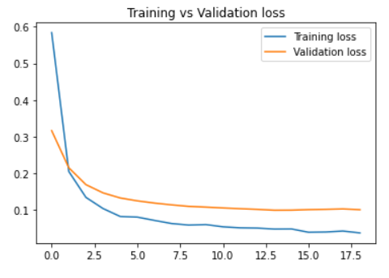
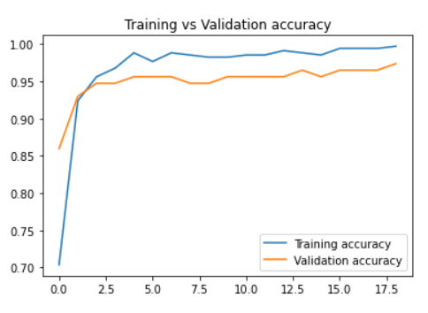
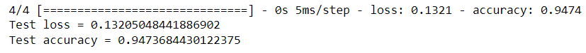

# Breast Cancer Classification Using Feedforward Neural Network
## 1. Summary
Breast cancer is the second leading cancer that caused death to the women. Hence, the diagnosis of the breast cancer at the early stage is crucial and can save lives. However, sometimes doctors may mistakenly diagnose benign tumor (which is noncancerous) as malignant tumor. Hence, the help of machine learning can be really helpful to aid the doctors correctly diagnose the cancer. The aim of this project is to create a highly accurate deep learning model to predict breast cancer (whether the tumour is malignant or benign). The model is trained with [Wisconsin Breast Cancer Dataset](https://www.kaggle.com/datasets/uciml/breast-cancer-wisconsin-data)

## 2. IDE and Framework
This project is created using Jupyter notebook as the main IDE. The main frameworks used in this project are Pandas, Scikit-learn and TensorFlow Keras.

## 3. Methodology
### 3.1. Data Pipeline
The very first and commonly longest step is the data cleaning or data preprocessing where the unwanted features are removed based on their correlation to the labelled data. Then, label is being one-hot encoded. Then the data is split into train-validation-test sets, with a ratio of 60:20:20. 

### 3.2. Model Pipeline
A feedforward neural network is constructed based on our main problem which is classification problem.. The structure of the model is fairly simple. Figure below shows the structure of the model.

The model is trained with a batch size of 32 and for 100 epochs. Early stopping is applied in this training. The training stops at epoch 19, with a training accuracy of 99% and validation accuracy of 99.71%. The two figures below show the graph of the training process.

 

## 4. Results
Upon evaluating the model with test data, the model obtain the following test results, as shown in figure below.

